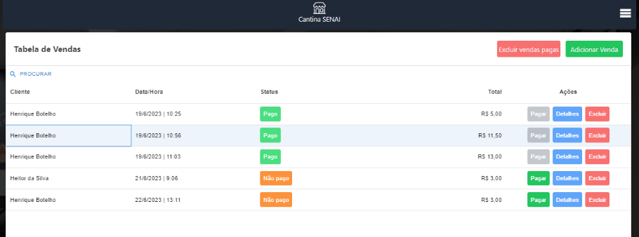
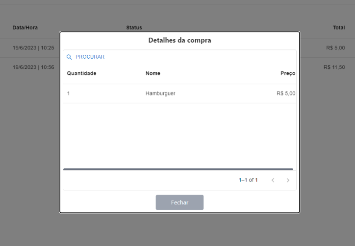
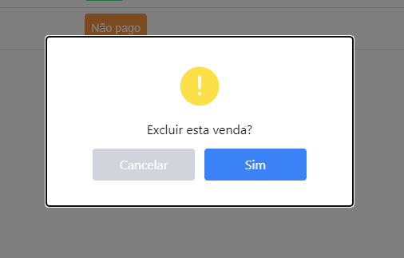
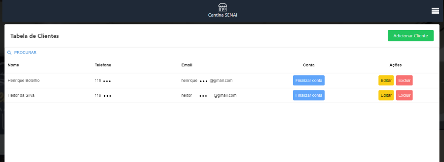

# Cantina SENAI 🍔 🍟

### O site se encontra disponível neste [link](https://sistema.cantinasenai.com.br/)

#### Desenvolvedores

[Abner](https://github.com/ClaushSouza) | 
[Álvaro](https://github.com/alvarexx) | 
[Bianca](https://github.com/BiancaMarcondes) |
[Eduarda](https://github.com/dudaribas) |
[Fabíola](https://github.com/fabiola-girotti) | 
[Gabriel](https://github.com/Gctyx) | 
[Giovanna](https://github.com/GiPaiva) | 
[Guilherme Cunha](https://github.com/Guigite) |
[Guilherme Leoni](https://github.com/GuiLeoni) | 
[Gustavo Alves](https://github.com/Decompilationist) |
[Gustavo Lima](https://github.com/gustavol1) |
[Heitor](https://github.com/heitorsclaudino) |
[Henrique Botelho](https://github.com/Henrique-Botelho) | 
[Henrique Lobo](https://github.com/HLN-lobo) | 
[Luiz](https://github.com/LAugustoLeite) | 

#### Linguagens e tecnologias

- ***JSX*** - linguagem de marcação usada no React.js (Html envolvido por JavaScript)
- ***JavaScript*** - linguagem de programação utilizada na criação da dinâmica e interatividade das páginas, autenticação e segurança do site e comunicação com o servidor e banco de dados
- ***MySQL*** - banco de dados utilizado
- ***Node.js*** - Ferramenta usada para facilitar o a comunicação entre o banco de dados e o site

#### Bibliotecas e Frameworks

- ***React.js*** - uma biblioteca JavaScript utilizada para auxiliar o desenvolvimento das páginas

- ***Tailwind.css*** - uma biblioteca utilizada para facilitar e dinamizar a estilização das páginas

- ***Vite*** - um framework utilizado para simplificar a estrutura do projeto (me corrijam henrique e guilherme, pra ver se é isso mesmo)

### Estrutura do projeto 

- public/: diretório contendo a imagem logo do projeto, publica e disponível no título do HTML principal do site

- src/: diretório contendo os arquivos essenciais do projeto.

- components/: pasta que contém os componentes disponíveis e reutilizáveis no site

- pages/: pasta que contém as páginas principais da aplicação.

#### Arquivos

- api.jsx: arquivo com as configurações básicas para efetuar requisições na nossa API
- App.jsx: arquivo principal que configura as rotas e estrutura geral do site.
- main.jsx: arquivo responsável por renderizar o App.jsx

## Introdução

#### O que é o projeto Cantina SENAI?

O sistema Cantina SENAI consiste em uma plataforma de gerenciamento de produtos e contas pendentes de usuários da cantina do SENAI Suíço-Brasileiro "Paulo Ernesto Tolle". No site, é possível realizar as [operações básicas de CRUD](https://coodesh.com/blog/dicionario/o-que-e-crud/) com os produtos do [cardápio da cantina do SENAI](https://www.cantinasenai.com.br), contas e compras de cada cliente registrado no sistema.

**O sistema apresenta:**

- login no padrão JWT (Json Web Token) e criptografia de senhas para maior segurança :lock:

- envio de e-mail automaticamente após as operações que afetam cliente e cantina (abertura ou fechamento de contas, por exemplo.) para maior tranparência

**Porque desenvolvemos este site?**

Ao analisarmos a situação da cantina da escola, percebemos que as anotações em caderno diárias feitas pelos funcionários que registravam as contas em aberto dos clientes poderiam se tornar um problema, a medida que, com o tempo, seria cada vez mais difícil de recuperar contas passadas, o que poderia gerar imprecisão pela omissão de dados no cálculo da conta final dos clientes frequentadores da cantina. Por exemplo, se um cliente escolhesse comprar hoje na cantina, mas pagar somente daqui a dois meses, os funcionários seriam responsáveis por verificar essa conta em aberto, voltando dois meses de anotações e arriscando não encontrar partes da conta pendente. 

Ainda pensando nos problemas físicos das anotações, os preços do cardápio da cantina eram atualizados por etiquetas adesivas, que além de não serem uma solução prática, poluiam o cardápio visualmente. Outro problema encontrado no cardápio foi no possível cenário de atualização de produtos, que poderiam sair ou entrar no cardápio acarretando no desenvolvimento de um novo folheto por completo, novamente uma solução nada ideal.

O site ainda possibilita maior transparência nas relações cantina-cliente uma vez que ao registrar uma nova compra pra determindao cliente, envia um e-mail automaticamente com os detalhes da compra (produtos comprados e seu valor) para o respectivo consumidor.

Pensando nesses problemas, desenvolvemos este site para gerenciar os dados de contas pendentes, clientes e produtos disponíveis no cardápio. Por isso, vamos dar destaque para as 3 principais entidades do projeto. Qualquer pessoa com acesso autorizado a aplicação pode realizar as 4 operações de CRUD com: 

- ***Contas pendentes ou vendas*** - Possuem compras onde cada uma tem: um cliente a quem está atrelada,  produtos comprados, data e hora do seu registro, detalhes e status de pagamento (Pago | Não pago)

- ***Clientes*** - Possuem dados como nome, e-mail e telefone

- ***Produtos disponíveis no cardápio*** - Possuem nome, preço, categoria (salgados, doces, etc.) e descrição

Para cada uma das entidades temos uma página específica do site, que conta também com um manual de usuário. Para facilitar a navegação entre as páginas, um menu está disponível em todas as telas da aplicação.

Após a tela de login (foto abaixo), o usuário, se válido, é direcionado para a ***Página de vendas***.

#### Página de Vendas

A página de vendas é responsável por gerenciar as contas pendentes dos clientes. Optamos por usar o nome de vendas para auxiliar os funcionários da cantina, que utilizarão a plataforma todos os dias. 
Consiste na apresentação de todas as contas em aberto registradas. Integrada com uma caixa de busca, permite que o funcionário busque todas as compras de um cliente específico, pagas e não pagas.
Permite ainda o pagamento ou a exclusão de compras específicas, ambas ações irreversíveis. 

A página de vendas exibe os detalhes de todas as vendas (ou compras) registradas no sistema. A estrutura de tabelas adotada foi escolhida para melhor visualização dos dados e será reutilizada por toda a aplicação. 

A seguir, uma breve descrição dos botões e suas funcionalidades:

- ***"Pagar"*** - Altera o status da compra para "Pago".

- ***"Detalhes"*** - Exibe os detalhes da compra (items comprados e seu respectivo valor). 

- ***"Excluir"*** - Exclui ***permanentemente*** a compra do sistema, após confirmação.

Fotos das telas seguintes ou de confirmação dessas operações:

***Nota***: nosso sistema não trabalha com transações monetárias, todas suas funcionalidades são para fins de controle e registro. Pagamentos são feitos à parte, diretamente com a cantina.

#### Página de Clientes

A página de clientes é responsável pela adição, edição, exclusão e leitura dos dados dos clientes registrados no sistema. Em um cenário de dados incorretos, por exemplo, ela possibilita fácil atualização.

Além disso, a página possui o botão "Finalizar conta" para cada um dos clientes registrados. Se o cliente tiver uma conta em aberto, o sistema somará todas as suas compras e mostrará o valor total (e individual de cada compra). Ao prosseguir, todas as compras daquele cliente terão seu status alterado para "Pago" e a conta do cliente é fechada.

Se o cliente tiver uma conta fechada, ou seja, sem compras de status "Não pago" registradas, o sistema informará o funcionário e disponibilizará apenas um botão para voltar a tela de clientes.

***legenda***: Tela de gerenciamento e visualização de clientes

A página de clientes exibe os detalhes de todos os clientes registrados no sistema. A seguir, uma breve descrição dos botões e suas funcionalidades:

- ***Adicionar cliente*** - 

- ***Editar***

- ***Excluir***

- ***Finalizar conta***

#### Página de Produtos

A página de produtos é responsável pela adição, edição, exclusão e leitura dos produtos registrados no sistema e que alimentam o [cardápio da cantina](https://www.cantinasenai.com.br).

***legenda***: Tela de gerenciamento e visualização de produtos

A página de produtos exibe os detalhes de todos os produtos registrados no sistema. A seguir, uma breve descrição dos botões e suas funcionalidades:

- ***Adicionar produto*** - carrega uma página que solicita os dados para a criação de um novo produto.

- ***Editar*** - carrega uma página contendo os dados do produto a ser alterado e permite qualquer modificação.

- ***Excluir*** - exclui ***permanentemente*** aquele produto do sistema, após confirmação.

## Conclusão

Segurança/Gerenciamento

